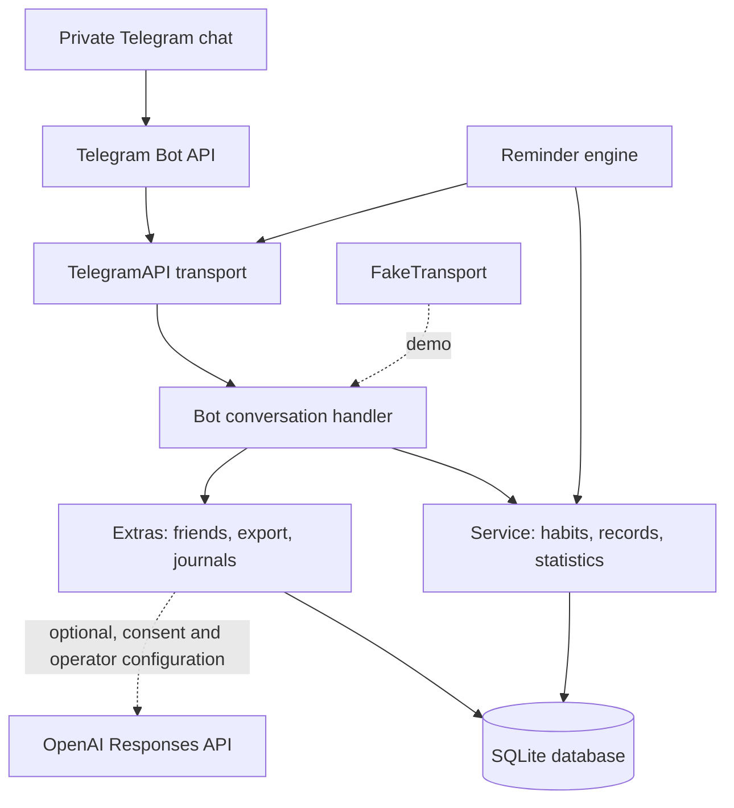

# Architecture

KitMode separates habit rules and SQLite persistence from the Telegram interface. The demo injects a fake transport, so the domain and conversation flow can run without a bot token or Telegram network access.

## Components

- `kitmode/db.py` creates the SQLite schema, enables foreign keys, and provides nested transactions.
- `kitmode/core.py` validates goals, settings, records, edits, pauses, undo operations, and progress calculations. Each record stores a snapshot of the goal rules that applied when it was made.
- `kitmode/schedules.py` contains pure date and wall-clock conversion rules, including personal-day boundaries and daylight-saving transitions.
- `kitmode/telegram.py` implements the private-chat conversation flow. The database stores flow state; inline-button data contains short opaque tokens whose ownership and expiry are checked before use.
- `kitmode/choices.py` supplies short, button-first onboarding, creation, settings and daily dialogs; service rules remain in core. One UI-version marker retires old keyboards without resetting records.
- `kitmode/branding.py` owns localized public profile/command definitions and explicit API setup/readback; normal polling does not apply profile changes.
- `kitmode/transport.py` wraps Telegram HTTPS calls. `FakeTransport` records simulated sends for demos and tests.
- `kitmode/extras.py` handles social sharing controls, verification requests, timers, urge notes, export/import, deletion, feedback, challenges, and optional AI.
- `kitmode/reminders.py` schedules durable reminder jobs; indexed due-job checks run every 0.5 seconds, with bounded outgoing batches.
- `kitmode/runtime.py` keeps a bounded, network-only long-poll reader separate from the scheduler. All SQLite operations remain on the main thread. The reader advances its Telegram offset only after the whole batch has committed; interrupted or failed actions can be retried without skipping updates. Polling retries do not suspend reminders.

## Data flow

Telegram updates enter through the transport and are passed to `Bot.handle`. Update IDs are deduplicated in SQLite. The bot applies a service operation and sends the resulting text or inline keyboard through the selected transport. Telegram callback payloads do not carry trusted user data: the service resolves a token, checks the user and expiry, and applies one-use behavior to mutation buttons.

The database is local to the running host. It is not a managed server or a sync service. SQLite transactions group related changes, and saved reminder jobs survive a process restart. The process must still be running to deliver them.

Migration 1 creates the core schema; migration 2 adds effective archive dates. Extras
has its own schema marker and idempotent tables. A database from a newer core version
is refused. A process lock prevents two polling/scheduling instances from sharing
the same file; the database also records the bot's numeric ID to prevent accidental
reuse with a different bot token.

Each logical reminder has a unique habit/date/time identity. On restart, past-day
jobs expire; jobs over 90 minutes late expire, and current jobs are coalesced by
habit/user. At most one opt-in repeat is created. Forbidden recipients stop receiving
reminders. Explicit 429 responses honor `retry_after`; other transient failures use
bounded backoff, up to five attempts. Outgoing Telegram sends have no provider-level
idempotency key: a crash or lost response after delivery can still produce a duplicate
outgoing message. Domain progress and XP remain deduplicated.

## Time rules

Stored instants use timezone-aware UTC timestamps. Habit opportunities use the user's IANA time zone and personal-day boundary. The first occurrence is chosen when a fall-back clock repeats a local time; a nonexistent spring-forward time moves forward to the first valid minute. Changing time-zone settings affects future scheduling and does not rewrite historical dates.

## Boundaries

The fake transport verifies simulated behavior, not Telegram delivery, BotFather username availability, Telegram account limits, or production hosting. AI is optional and disabled unless operator configuration and user consent both allow a request. Sensitive journals and evidence are not included automatically in AI context.
